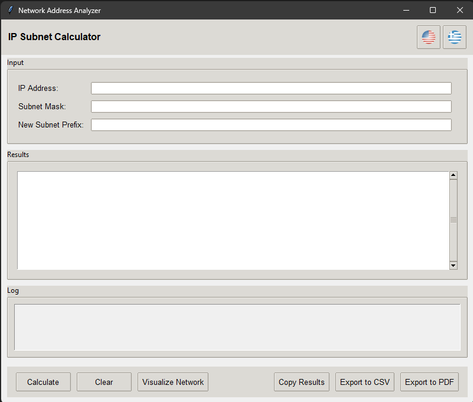

# IP Subnet Calculator


A user-friendly desktop application built with Python and Tkinter for calculating and analyzing IPv4/IPv6 network subnets.



## Key Features

* **Full IPv4 & IPv6 Support:** Performs detailed calculations for both major IP versions.
* **Subnetting Calculator:** Easily subdivide a larger network into multiple smaller subnets by providing a new prefix.
* **Detailed Network Analysis:** Calculates essential information such as:
    * Network & Broadcast Addresses
    * Netmask & Wildcard Mask
    * CIDR Notation
    * Total & Usable Host Counts
    * Usable Host Range
* **Network Visualization:** Generates a graphical, star-topology representation of the main network and its subnets.
* **Data Export:** Export calculation results to user-friendly **CSV** and **PDF** formats.
* **Multilingual Interface:** Supports both **English** and **Greek**.

## Technologies Used

* **Core:** Python 3
* **GUI:** Tkinter (via the modern `ttk` themed widgets)
* **Network Logic:** `ipaddress` standard library
* **Visualization:** `Matplotlib` & `NetworkX`
* **PDF/Image Handling:** `reportlab` & `Pillow`

## Installation & Setup

To get a local copy up and running, follow these simple steps.

### Prerequisites

* Python 3.8 or newer
* pip (Python package installer)

### Steps

1.  **Clone the repository:**
    ```sh
    git clone [https://github.com/ThanosDimou/IP-Subnet-Calculator.git](https://github.com/ThanosDimou/IP-Subnet-Calculator.git)
    cd IP-Calculator
    ```
    2.  **Create and activate a virtual environment (Recommended):**
    * **Windows:**
        ```sh
        python -m venv venv
        .\venv\Scripts\activate
        ```
    * **macOS / Linux:**
        ```sh
        python3 -m venv venv
        source venv/bin/activate
        ```

3.  **Install the required packages:**
    ```sh
    pip install -r requirements.txt
    ```

## Usage

Once the setup is complete, run the application with the following command:

```sh
python main.py
```

1.  Enter the IP Address and Subnet Mask (in CIDR or dotted-decimal format).
2.  (Optional) Enter a "New Subnet Prefix" to perform subnetting calculations.
3.  Click **Calculate** to see the results.
4.  Use the **Visualize**, **Export**, or **Copy** buttons to manage the results.

## License

Distributed under the MIT License. See `LICENSE` for more information.

## Acknowledgements


